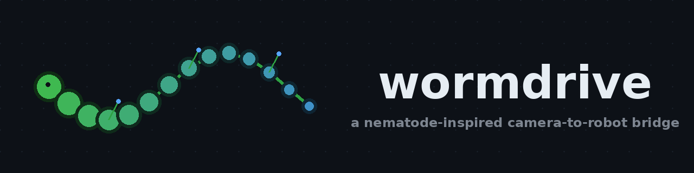
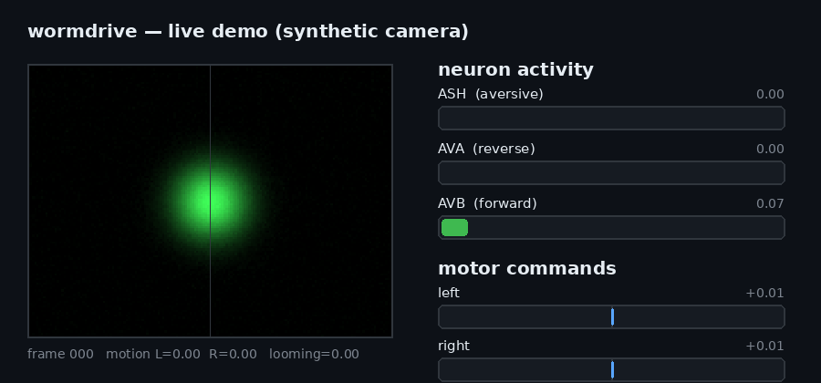
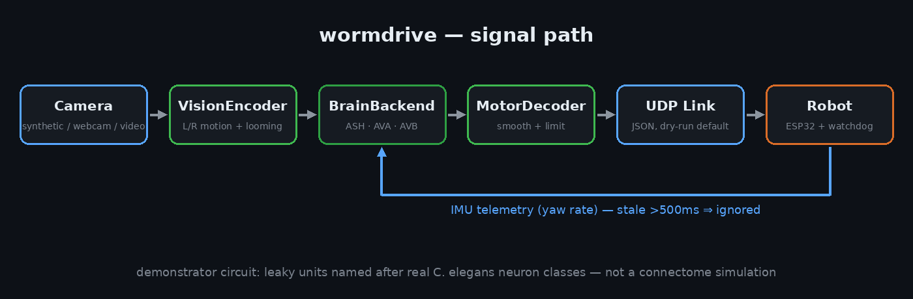

<p align="center">
  
</p>

<p align="center">
  <a href="https://github.com/frankxstein/wormdrive/actions/workflows/ci.yml"></a>
  
  
  
</p>

# wormdrive

**A nematode-inspired camera-to-robot bridge.**

An experimental interface between a camera, a small locomotion model loosely
inspired by *C. elegans*, and a physical robot. Visual motion and IMU signals
feed a leaky-integrator demonstrator; a decoder turns its activity into
left/right motor commands.

**Try it in 30 seconds.** The synthetic demo runs locally without a robot,
camera, or network connection.

> **Note:** This repository does not contain a biological brain or a
> connectome simulation. The default backend is a small hand-designed
> demonstrator loosely modeled on the *documented roles* of a few real
> *C. elegans* neuron classes (AVA, AVB, ASH) — not their actual biophysics,
> not real synaptic weights, and not a simulation of the real connectome.
> A real-connectome backend is an unimplemented stub (see below).

## Demo

<p align="center">
  
</p>

The synthetic blob drifts and looms. When the looming signal spikes, ASH
(aversive) drives AVA (reverse) above AVB (forward) and both motor
commands flip negative — the escape reflex. This GIF was generated
directly from the real pipeline (`examples/render_demo.py` regenerates it).

## What it does

- Runs locally with synthetic frames, a webcam, or a video file.
- Estimates motion in the left/right halves of the frame and a crude
  center-relative expansion ("looming") signal.
- Drives a small forward/backward command circuit (AVB = forward, AVA =
  backward) with mutual suppression, plus an ASH-style aversive unit that
  triggers reversal when looming is high.
- Steers by nudging the two motor outputs apart based on left/right motion
  asymmetry.
- Smooths and limits motor output; defaults to dry-run. Physical command
  transmission requires `--send`.
- Validates JSON/UDP telemetry and ignores malformed or mistyped packets.

## Why C. elegans?

*C. elegans* is the only organism with a fully mapped connectome (302
neurons, wired diagram known since the 1980s, refined since). Its
forward/backward locomotion switch — the AVB/AVA command interneuron pair,
with ASH as one of several sensory neurons that can trigger reversal — is
one of the best-studied circuits in neuroscience. That makes it a fitting,
well-documented skeleton for an engineering demo like this one, even though
what's implemented here is a simplified stand-in, not the real circuit.

## Architecture

<p align="center">
  
</p>

See [docs/ARCHITECTURE.md](docs/ARCHITECTURE.md) for the full signal path
and packet format.

## Quick start

Requires Python 3.10+.

```bash
git clone https://github.com/YOUR_USERNAME/wormdrive.git
cd wormdrive
python3 -m venv .venv
source .venv/bin/activate
pip install -e ".[dev]"
python -m wormdrive.main --synthetic --dry-run --steps 90
```

## Mock demo

```bash
python -m wormdrive.main --synthetic --dry-run --steps 90
python -m wormdrive.main --backend mock --camera 0 --dry-run
python -m wormdrive.main --backend mock --video /path/to/your/video.mp4 --dry-run
```

Camera/video mode requires OpenCV: `pip install -e ".[camera]"`.

Terminal output includes motion, looming, IMU yaw, the ASH/AVA/AVB
activity, and the decoded left/right commands per frame.

## Connecting a physical robot

```bash
cp config.example.yaml config.yaml
# set robot_ip, robot_port, pc_port and calibrated motor limits
python -m wormdrive.main --camera 0 --config config.yaml --send
```

The PC sends zero commands once telemetry is stale (>500ms). **The receiver
must independently stop motors after 500ms without a fresh command** — the
PC-side watchdog alone is not a safety mechanism. An ESP32 firmware scaffold
implementing this watchdog lives in [firmware/](firmware/), but it has not
been compiled or tested on a board. UDP delivery is not guaranteed and the
packet format has no authentication.

## Real connectome integration

`ConnectomeBackend` checks the configured dataset path and then raises
`NotImplementedError`. No graph is loaded and no simulated result is
fabricated. This is an intentional extension point for a future backend
built on real *C. elegans* connectivity data (e.g. from the OpenWorm
project or WormAtlas), not a working feature yet.

## Repository structure

```
src/wormdrive/           CLI, vision, protocol, decoder, config loading
src/wormdrive/brain/     Backend interface, mock circuit, connectome stub
firmware/esp32/          Untested ESP32 receiver scaffold (watchdog contract)
tests/                   Brain, decoder, protocol, and config tests
docs/                    Architecture notes
examples/                Library-usage demo + demo-GIF renderer
assets/                  Logo, architecture diagram, demo GIF
.github/workflows/       CI: lint + tests + CLI smoke test on 3.10-3.12
```

## Current limitations

This is an early proof of concept. The model is hand-designed and does not
use real connectome data. Motion signals are frame-difference magnitudes,
not a biological vision model. Looming is a center-energy-growth heuristic,
sensitive to camera motion and lighting — it is not collision avoidance.
There's no gait generator, physical simulation, or recorded robot
demonstration yet. The firmware is a scaffold and has not been compiled or
tested on a board. UDP has no authentication, reliability, or replay
protection.

## Roadmap

- [ ] Real optical flow (Farneback) behind the same `VisionFeatures` interface
- [ ] Live neuron-activity visualization dashboard
- [ ] `ConnectomeBackend` on real OpenWorm/WormAtlas connectivity data
- [ ] Compile and bench-test the ESP32 firmware; wire up a real IMU
- [ ] Recorded demonstration on a physical robot

## Scientific sources

- Chalfie, M. et al. (1985). *The neural circuit for touch sensitivity in
  Caenorhabditis elegans.* Journal of Neuroscience.
- Gray, J.M., Hill, J.J., Bargmann, C.I. (2005). *A circuit for
  navigation in Caenorhabditis elegans.* PNAS.
- [OpenWorm project](http://openworm.org/)
- [WormAtlas](https://www.wormatlas.org/)

## Inspiration and attribution

Loosely inspired by the shape of other camera-to-robot bridge demos in the
same space — vision encoder → small neural-ish backend → motor decoder →
UDP — reimplemented independently around a different (nematode) circuit and
its own code. No third-party project source code or datasets are bundled.
Check any related project's license before reusing its material.

## Safety

Start with dry-run, then calibrate with the robot lifted off the ground.
Use an independent motor power cutoff and a receiver-side watchdog. A
motion heuristic cannot protect people or equipment. Use a trusted,
isolated network.

## Development

```bash
ruff check .
pytest -q
python -m wormdrive.main --synthetic --dry-run --steps 20
```

## License

MIT. See [LICENSE](LICENSE).
